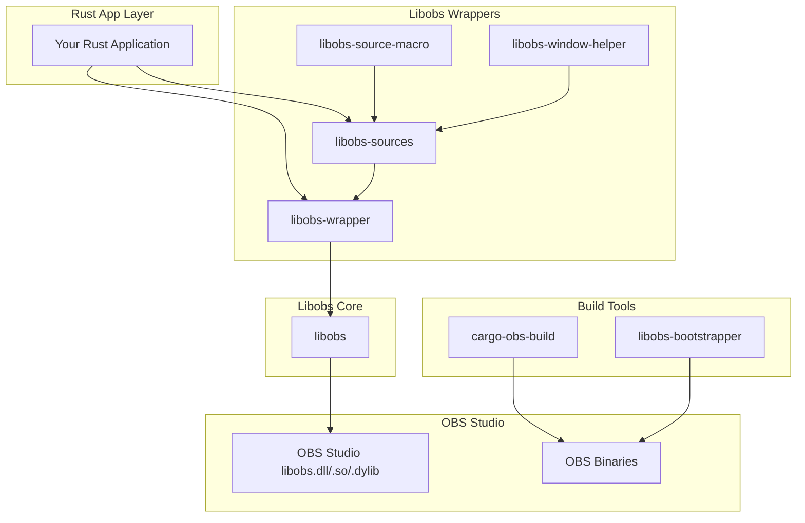

# libobs-rs Organization


**Safe, ergonomic Rust bindings for OBS Studio's libobs**

The libobs-rs organization provides comprehensive Rust bindings and tooling for OBS Studio's core library (libobs), enabling developers to create video recording, streaming, and media processing applications with the full power of OBS Studio in Rust.

## 🎯 Mission

Our mission is to make OBS Studio's powerful media processing capabilities easily accessible to Rust developers through:

- **Safe abstractions** over libobs C APIs
- **Ergonomic interfaces** that follow Rust conventions
- **Comprehensive tooling** for building and distributing OBS-powered applications

## 📦 Core Crates

### [`libobs`](https://crates.io/crates/libobs)
Low-level Rust bindings to OBS Studio's libobs library. Provides direct access to OBS functionality. Use only if you know what you are doing

### [`libobs-wrapper`](https://crates.io/crates/libobs-wrapper)
High-level, idiomatic Rust wrapper around libobs. Offers safe abstractions for common OBS operations like scene management, source creation, and output handling.

### [`libobs-sources`](https://crates.io/crates/libobs-sources)
Ready-to-use implementations of common OBS sources (video capture, audio capture, etc.) with Rust-friendly APIs.

### [`libobs-source-macro`](https://crates.io/crates/libobs-source-macro)
Procedural macros for creating custom OBS sources with minimal boilerplate code.

### [`libobs-window-helper`](https://crates.io/crates/libobs-window-helper)
Utilities for window and display capture functionality across different platforms.

### [`libobs-bootstrapper`](https://crates.io/crates/libobs-bootstrapper)
Runtime OBS binary management - automatically downloads and installs appropriate OBS binaries for your application.

### [`cargo-obs-build`](https://crates.io/crates/cargo-obs-build)
Cargo subcommand and build tool for managing OBS dependencies and building OBS-powered applications.

## 🚀 Quick Start

### 1. Install the build tool
```bash
cargo install cargo-obs-build
```

### 2. Add dependencies to your `Cargo.toml`
```toml
[dependencies]
libobs-wrapper = "5.2"
libobs-sources = "0.3"

[package.metadata]
# Optional: specify OBS version (defaults to latest compatible)
# libobs-version = "31.0.3"
```

### 3. Set up OBS binaries
```bash
# For development
cargo obs-build --out-dir target/debug

# For release builds
cargo obs-build --out-dir target/release
```

### 4. Start recording
```rust
use libobs_wrapper::obs::OBSContext;
use libobs_sources::windows::MonitorCaptureSource;

fn main() -> Result<(), Box<dyn std::error::Error>> {
    let rec_file = ObsPath::from_relative("leak_test_recording.mp4").build();
    let path_out = PathBuf::from(rec_file.to_string());


    let (mut context, mut output) = initialize_obs(rec_file);
    let mut scene = context.scene("main")?;
    scene.set_to_channel(0)?;

    let source_name = "test_capture";
    context
        .source_builder::<WindowCaptureSourceBuilder, _>(source_name)
        .unwrap()
        .set_capture_method(ObsWindowCaptureMethod::MethodAuto)
        .set_window(&window)
        .add_to_scene(&mut scene)?;

    // Start recording
    output.start()?;
    println!("Recording started");

    // Record for 3 seconds
    std::thread::sleep(Duration::from_secs(3));

    println!("Recording stop");
    output.stop()?;
    
    // Your application logic here...
    
    Ok(())
}


pub fn initialize_obs<T: Into<ObsString> + Send + Sync>(rec_file: T) -> (ObsContext, ObsOutputRef) {
    let _ = env_logger::Builder::from_env(Env::default().default_filter_or("debug"))
        .is_test(true)
        .try_init();

    #[allow(unused_mut)]
    let mut context = ObsContext::new(StartupInfo::default()).unwrap();

    // Set up output to ./recording.mp4
    let mut output_settings = context.data().unwrap();
    output_settings.set_string("path", rec_file).unwrap();

    let output_name = "output";
    let output_info = OutputInfo::new("ffmpeg_muxer", output_name, Some(output_settings), None);

    let mut output = context.output(output_info).unwrap();

    // Register the video encoder
    let mut video_settings = context.data().unwrap();
    video_settings
        .bulk_update()
        .set_int("bf", 0)
        .set_bool("psycho_aq", true)
        .set_bool("lookahead", true)
        .set_string("profile", "high")
        .set_string("preset", "fast")
        .set_string("rate_control", "cbr")
        .set_int("bitrate", 10000)
        .update()
        .unwrap();

    let encoders = context.available_video_encoders().unwrap();

    println!(
        "Available encoders: {:?}",
        encoders
            .iter()
            .map(|e| e.get_encoder_id())
            .collect::<Vec<_>>()
    );
    let mut encoder = encoders
        .into_iter()
        .find(|e| {
            let t = e.get_encoder_id();
            t == &ObsVideoEncoderType::H264_TEXTURE_AMF
                || t == &ObsVideoEncoderType::AV1_TEXTURE_AMF
                || t == &ObsVideoEncoderType::OBS_NVENC_H264_TEX
        })
        .unwrap();

    println!("Using encoder {:?}", encoder.get_encoder_id());
    encoder.set_settings(video_settings);
    encoder.set_to_output(&mut output, "video_encoder").unwrap();

    // Register the audio encoder
    let mut audio_settings = context.data().unwrap();
    audio_settings.set_int("bitrate", 160).unwrap();

    let audio_info =
        AudioEncoderInfo::new("ffmpeg_aac", "audio_encoder", Some(audio_settings), None);

    output.create_and_set_audio_encoder(audio_info, 0).unwrap();

    (context, output)
}

```

## 🏗️ Architecture



## 📚 Documentation & Examples

- **[API Documentation](https://docs.rs/libobs-wrapper)** - Comprehensive API reference
- **[Examples Repository](./examples/)** - Working examples for common use cases:
  - 📺 Monitor capture recording
  - 🎮 Game capture integration
  - 🔄 Live streaming setup
  - 📱 Tauri desktop applications
  - ⏬ Runtime OBS installation

## 🌍 Platform Support

| Platform | Support Status | Notes |
|----------|----------------|-------|
| Windows  | ✅ Full | Complete support with all features |
| Linux    | 🔄 Planned | W.I.P |
| macOS    | 🔄 Planned | Basic support planned for future releases |

## 🤝 Contributing

We welcome contributions! Here's how you can help:

1. **🐛 Report Issues** - Found a bug? [Open an issue](https://github.com/libobs-rs/libobs-rs/issues)
2. **💡 Suggest Features** - Have an idea? We'd love to hear it
3. **🔧 Submit PRs** - Fix bugs, add features, improve documentation
4. **📖 Improve Docs** - Help make our documentation even better
5. **🧪 Test** - Try the crates on different platforms and report your experience

### Development Setup
```bash
git clone https://github.com/libobs-rs/libobs-rs.git
cd libobs-rs
cargo obs-build --out-dir target/debug
cargo obs-build --out-dir target/debug/deps
cargo nextest
```

## 📄 License

This project is licensed under the GPL-3.0 - see individual crate READMEs for specific license information.

## 🙏 Acknowledgments

- **[OBS Studio](https://obsproject.com/)** - The amazing open-source broadcasting software that makes this all possible
- **The Rust Community** - For creating an incredible ecosystem and tooling
- **All Contributors** - Every bug report, feature request, and pull request helps make this project better

## 🔗 Links

- [GitHub Organization](https://github.com/libobs-rs)
- [Crates.io Packages](https://crates.io/keywords/libobs)
- [Documentation](https://docs.rs/libobs-wrapper)

---

**Made with ❤️ by the libobs-rs community**
